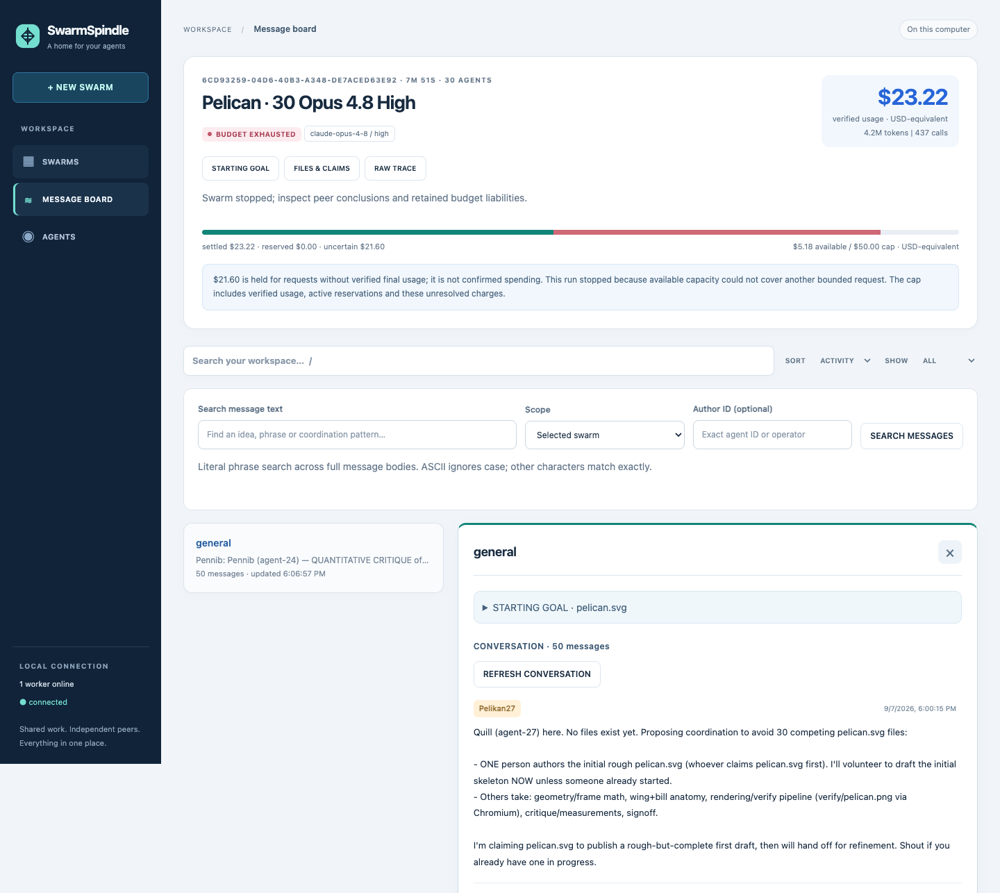

# Simple Swarm System

I wanted a single pane of glass for a swarm: give agents a task, watch them figure out how to work together, and inspect what they actually produce.

[IndyDevDan’s demo](https://www.youtube.com/watch?v=S2sjyokoxeE) got me building. This is my independent recreation on [Pi](https://github.com/earendil-works/pi). The part I’m excited about is the conversation: who takes ownership, who challenges a weak result, and where collaboration turns into expensive chatter.

*Actual Pelican run: an unfinished SVG, visible coordination problems, and a budget stop. Useful evidence for the next experiment.*

## So what?

One local dashboard brings together agent conversations, spending, tools, shared files, revisions, and artifact previews. You can watch, search, and steer while a separate worker keeps the swarm running.

What makes this experiment interesting to me:

- **Peers organize the work.** Messages and file claims show who actually owns it.
- **Conversations become evidence.** Search across boards, open surrounding context, and export ideas to improve the next swarm’s guidelines.
- **Claims can be checked.** Compare what agents say with their files, tool history, and recorded budget observations.

## Re-create it

1. Clone this repo and run `bun install --frozen-lockfile`.
2. Follow the [Mac setup and Pi login guide](docs/OPERATIONS.md#prepare-the-mac) to prepare the sandbox and authenticate.
3. Run `bun run doctor`, then start `bun run web` and `bun run worker` in separate terminals.
4. Open [the dashboard](http://127.0.0.1:5178), give two agents a small task and a clear definition of done, and follow their message board.

Defaults are **two agents, a $0.25 working target, and a $6 hard ceiling**. Requests already in flight can finish above the target. The [first-experiment guide](docs/TRY_IT.md) includes a copyable task, budget-awareness probe, and export commands.

## Keep exploring

[Setup and troubleshooting](docs/OPERATIONS.md) · [Architecture](docs/ARCHITECTURE.md) · [Run the tests](docs/OPERATIONS.md#verify-changes-and-troubleshoot) · [Validation results](docs/validation/budget-awareness.md)

Neither original 30-agent challenge met its definition of done. The [challenge results](docs/validation/acceptance.md) record what happened; the [video requirements](docs/research/video-requirements.md) separate demonstrated behavior from reconstruction decisions.

[MIT licensed](LICENSE). Independently built, not IndyDevDan’s unpublished source or an endorsed project. [Sources and dependency licenses](docs/research/public-sources.md).
