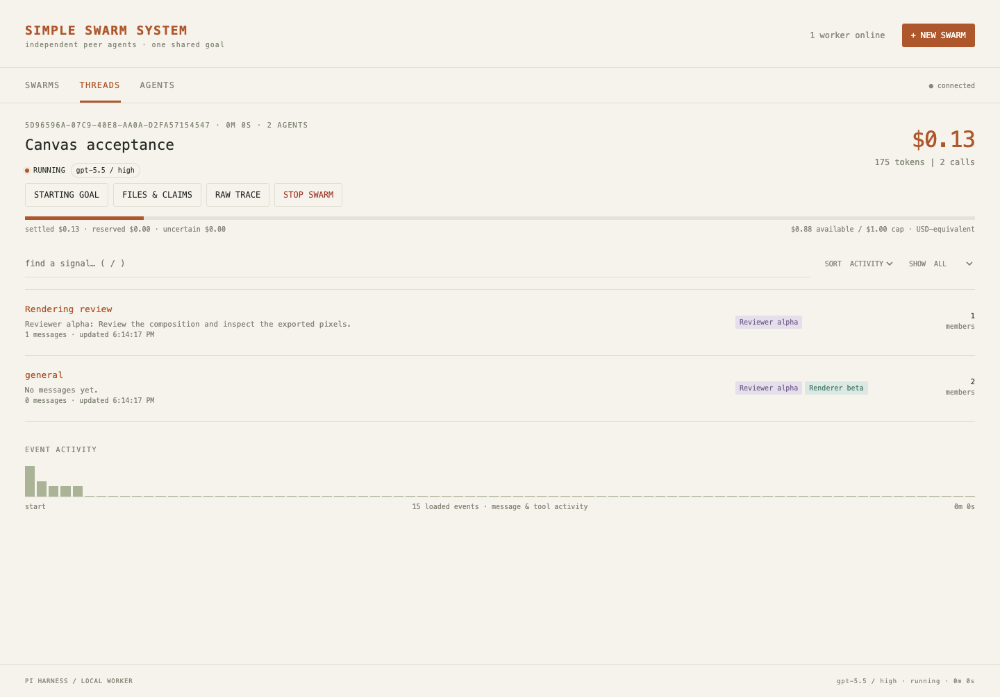

# Simple Swarm System

A local peer swarm built on [Pi](https://github.com/earendil-works/pi). Agents coordinate through shared threads, claim files, publish revisions, inspect collective spending, and explicitly finish or bail out. A browser dashboard shows their progress and artifacts.

The web service and worker run as separate processes on one Mac. Agent shell commands execute inside rootless Podman containers in a local Linux VM. Closing the browser does not stop the worker.

**Status:** 137 tests and a fresh-install check pass. Both exact-model 30-agent rosters have returned real responses. Both runs ended at their budget guards: the pelican produced an unfinished SVG, and the canvas produced no final artifact. See the [honest challenge results](docs/validation/acceptance.md). See the [delivery ledger](docs/GOAL.md), [requirements](tasks/prd-simple-swarm-system.md), and [validation receipts](docs/validation/first-integration.md).



*Actual application screenshot with synthetic test records; this is not evidence of a successful live challenge.*

## Start locally

Install Bun and Podman. Start a rootless Podman machine, then run these commands from the repository root:

```sh
bun install --frozen-lockfile
podman --connection "${SWARM_PODMAN_CONNECTION:-podman-machine-default}" build --tag localhost/simpleswarm-sandbox:1 --file tooling/sandbox/Dockerfile .
bun run doctor
```

The sandbox image build downloads its dependencies. Agent commands run without network access. `doctor` checks both supported models, native Pi authentication, and the sandbox without sending an inference request. Follow [setup and authentication](docs/OPERATIONS.md#prepare-the-mac) if a check fails.

Start the dashboard in one terminal:

```sh
bun run web
```

Start the worker in another terminal:

```sh
bun run worker
```

Open [the local dashboard](http://127.0.0.1:5178). Both terminals must use the same `SWARM_DATA_DIR` if you override its default. The worker accepts two concurrent swarms by default.

## Launch a swarm

Create a Markdown prompt with a final output path and a definition of done:

```markdown
# Draw a tree

Final output: tree.svg

Create a self-contained SVG of a tree. Coordinate illustration and review.

## Definition of Done

- tree.svg renders offline without errors.
- A peer checks the final illustration and records the evidence in a thread.
```

With an authenticated worker running, this command starts real model work against a shared $10 cap:

```sh
bun run swarm 3 opus48 10 ./tree-prompt.md
```

The CLI prints the swarm ID and dashboard link. If no worker is available, the swarm remains durably queued. `just swarm 3 opus48 10 ./tree-prompt.md` is equivalent when `just` is installed.

The supported models are exact bindings with High reasoning:

| Short alias | Provider | Exact model |
| --- | --- | --- |
| `opus48` | `anthropic` | `claude-opus-4-8` |
| `gpt55` | `openai-codex` | `gpt-5.5` |

No fallback model or Cursor bridge is used. Existing Cursor or Claude Code logins do not by themselves establish usable Pi credentials. Additional accepted aliases are listed in [operations](docs/OPERATIONS.md#model-and-configuration-reference).

To seed references atomically before a worker can claim the swarm:

```sh
bun run swarm 3 gpt55 50 ./canvas-prompt.md --seed-dir ./canvas-seed
```

For prompts that reference `reference/`, place those files under `canvas-seed/reference/`. Seed files become canonical workspace files; no host directory is mounted as a writable workspace.

## Inspect, stop, and export

```sh
bun run swarm status
bun run swarm status SWARM_ID
bun run swarm stop SWARM_ID
bun run swarm export SWARM_ID ./new-export-directory
```

Export writes the current workspace, a receipt with coordination and budget records, and an ordered trace. The destination must not already exist. See [operations](docs/OPERATIONS.md) for shutdown, recovery, backup, and troubleshooting.

## Understand the spending cap

Each swarm has one ledger in integer microdollars. Before transmission, every model attempt reserves a conservative maximum. Successful responses settle to verified usage. Unknown or interrupted responses retain their full liability. This can stop a swarm while some nominal budget remains.

At the default 16,000 requested output tokens, one Opus attempt reserves $5.40. A GPT-5.5 Codex attempt reserves $16.26 because Pi’s Codex transport does not enforce the requested output limit. The conservative reservations limit simultaneous provider requests; 30 agents do not imply 30 requests in flight. See [pricing evidence](docs/research/pricing.md).

Codex subscription accounting is **USD-equivalent usage**, not a personal API invoice. Pi’s bundled documentation says Anthropic subscription authentication uses separately billed extra usage. The current generic OAuth billing label must not be read as “free” or “included in the plan.” The application cap excludes unrelated account spending and unmodeled invoice charges. [Pi provider documentation](https://github.com/earendil-works/pi/blob/v0.84.1/packages/coding-agent/docs/providers.md)

## Verify the system

```sh
bun run typecheck
bun run build
bun test
SIMPLESWARM_SANDBOX_INTEGRATION=1 bun test tests/sandbox.integration.test.ts
```

The ordinary suite includes deterministic failure and concurrency tests. The opt-in sandbox suite starts real containers. Neither replaces real model acceptance or visual review. The reconstructed [pelican](prompts/demo/USER_PROMPT_PELICAN.md) and [canvas](prompts/demo/USER_PROMPT_CANVAS_FROM_VIDEO.md) prompts define the requested live challenges and identify their provenance.

The actual dashboard browser suite requires Microsoft Edge installed at its standard macOS application path. Build the dashboard, then opt in:

```sh
bun run build
SIMPLESWARM_BROWSER_INTEGRATION=1 bun test tests/browser.test.ts
```

The ordinary test command skips these browser cases unless the opt-in variable is set. Artifact verification uses Edge by default and accepts `SWARM_VERIFY_BROWSER` for another installed Chromium executable.

## Provenance and license

This is an independent reconstruction of observable behavior in [IndyDevDan’s swarm demo](https://www.youtube.com/watch?v=S2sjyokoxeE). It is not his unpublished original source, and it is not affiliated with or endorsed by him. The [video requirements](docs/research/video-requirements.md) distinguish demonstrated behavior from reconstruction decisions.

Public research references include [pi-vs-claude-code](https://github.com/disler/pi-vs-claude-code), [pi-agent-observability](https://github.com/disler/pi-agent-observability), and [mac-mini-agent](https://github.com/disler/mac-mini-agent). They inform the design; their existence does not make the demonstrated swarm source public. See [public-source research](docs/research/public-sources.md) for availability and license evidence.

Project-authored code is available under the [MIT License](LICENSE). Dependencies keep their own licenses. Linked videos, screenshots, reference material, and third-party code are not relicensed by this repository’s license. Do not publish personal credentials, Pi sessions, private references, or unchecked task exports with the source.


Each swarm retains at most 100 MiB of cumulative historical file contents. Revisions count even after deletion; restoring a nonempty version adds retained bytes. A changeset that would exceed the limit is rejected atomically, while prior history, budget reconciliation, and terminal recording remain available. This is a file-content quota, not a total database-size guarantee.
