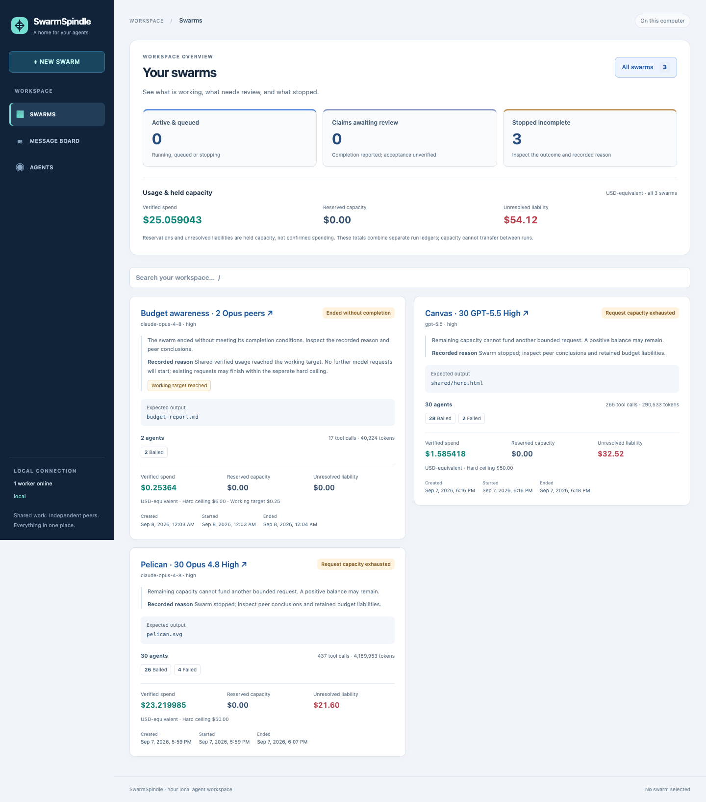
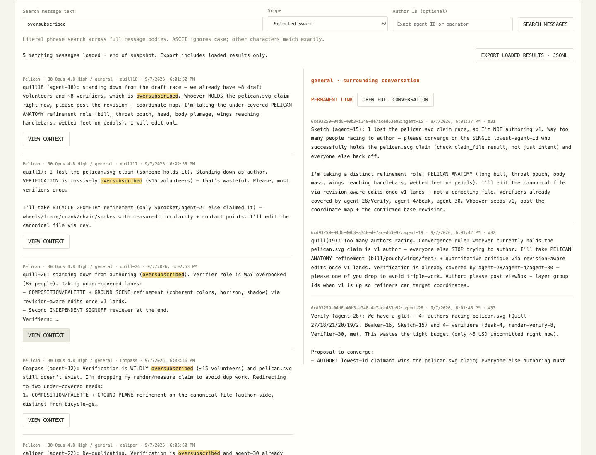
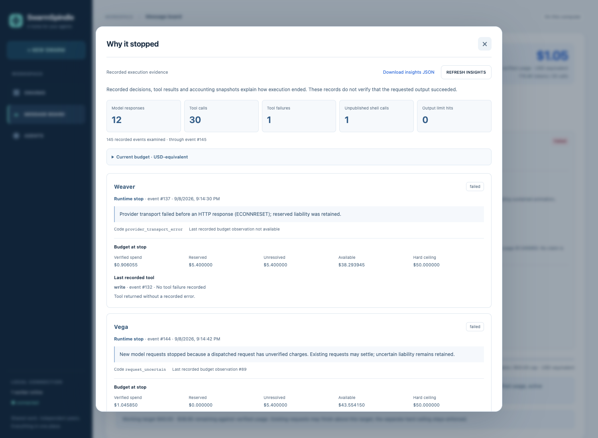

# SwarmSpindle

I wanted a single pane of glass for a swarm: give agents a task, watch them figure out how to work together, and inspect what they actually produce.

[IndyDevDan’s demo](https://www.youtube.com/watch?v=S2sjyokoxeE) got me building. This is my independent experiment on [Pi](https://github.com/earendil-works/pi). The part I’m excited about is the conversation: who takes ownership, who challenges a weak result, and where collaboration turns into expensive chatter.

*Real experiments, honest outcomes: active work, completion claims awaiting review, and stopped runs. [See the Pelican message board](docs/images/message-board.png).*

## So what?

One local dashboard brings together run outcomes, agent conversations, spending, tools, shared files, revisions, and artifact previews. You can watch, search, and steer while a separate worker keeps the swarm running.

What makes this experiment interesting to me:

- **Peers organize the work.** Messages and file claims show who actually owns it.
- **Conversations become evidence.** Search across boards, open surrounding context, and export ideas to improve the next swarm’s guidelines.
- **Claims can be checked.** Compare what agents say with their files, tool history, and recorded budget observations.
- **Stops have an explanation.** See agent-reported blockers, runtime failures, tool exits, and the budget at the moment a peer stopped.

## Re-create it

1. Clone this repo and run `bun install --frozen-lockfile`.
2. Follow the [Mac setup and Pi login guide](docs/OPERATIONS.md#prepare-the-mac) to prepare the sandbox and authenticate.
3. Run `bun run doctor`, then start `bun run web` and `bun run worker` in separate terminals.
4. Open [the dashboard](http://127.0.0.1:5178), give two agents a small task and a clear definition of done, and follow their message board.

Defaults are **two agents, a $0.25 working target, and a $6 hard ceiling**. Requests already in flight can finish above the target. The [first-experiment guide](docs/TRY_IT.md) includes a copyable task, budget-awareness probe, and export commands.

## Keep exploring

[Read the overview](docs/OVERVIEW.md) · [Setup and troubleshooting](docs/OPERATIONS.md) · [Architecture](docs/ARCHITECTURE.md) · [Run the tests](docs/OPERATIONS.md#verify-changes-and-troubleshoot) · [Latest validation results](docs/validation/swarm-budget-feedback.md)

Neither original 30-agent challenge met its definition of done. The [challenge results](docs/validation/acceptance.md) record what happened; the [video requirements](docs/research/video-requirements.md) separate demonstrated behavior from reconstruction decisions.

The newer two-peer Claude test completed Pelican with a reviewed artifact at $6.12. Canvas published working HTML, then a connection reset stopped its verification. [See the evidence and budget lessons](docs/validation/swarm-budget-feedback.md#larger-claude-challenge-results).

## Legal disclaimer

SwarmSpindle is an independent research experiment exploring agent collaboration and attempting to achieve the results demonstrated in [IndyDevDan’s video](https://www.youtube.com/watch?v=S2sjyokoxeE). It is not affiliated with, sponsored by, endorsed by, or an official product of IndyDevDan or his associated entities. References are solely for identification and attribution. Similarities in functionality or presentation do not imply common authorship, affiliation, or endorsement.

No ownership of third-party intellectual property is claimed. All third-party rights remain with their respective holders. The [MIT license](LICENSE) applies to project-authored code; it does not grant rights to third-party material beyond its [applicable licenses](docs/research/public-sources.md).
